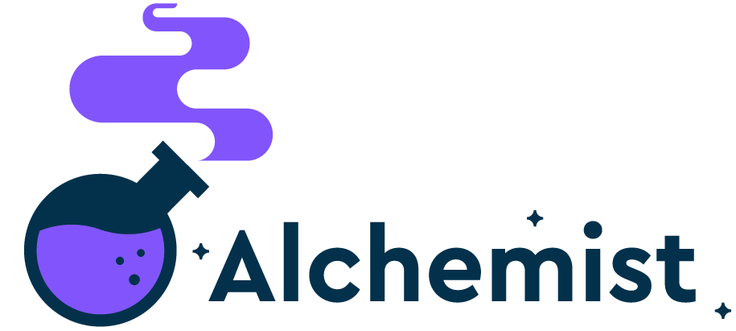

# Alchemist


Alchemy is a philosophical and protoscientific tradition practiced throughout Europe, Africa and Asia. It aimed to purify, mature, and perfect certain objects.

Data is the most important asset you have. Analyzing it can give you priceless insights into your customers, product and a sense of direction with any decision. But, Data manipulation and analysis comes with a predefined set of problems:

1. Loading the data from different sources and with different triggers
2. Cleaning and Transforming the data to suitable formats
3. Writing this data in a format that is suitable for the next stage or engine

And then with big data comes the problem of cost...


## Another ETL engine?

Alchemist was built with 2 main goals in mind:
1. Being lightweight: include in any JavaScript code and use.
2. Being Flexible: Use the provided adapters or create your own.

The typical flow for an ETL engine is:
- E(xtract): Read data from a certain source
- T(ransform): Manipulate the data in a single or multiple steps
- L(load): Load the data in a format suitable for the next consuming engine or for analysis.

And with alchemist you get the additional distinction of passing an object of Valid and Invalid data between steps so you can:
- access the data
- manipulate it

The full flow is demonstrated in the following diagram:


## How to define a pipeline
The typical usage of alchemist is in the form of jobs. Each job will define a single pipeline consisting of input, transformation(s), output.

### Assumptions
We will make a couple of assumptions to define the context of our functions execution:
1. Our code will be executed as an AWS lambda
2. The lambda function triggers a handler that initializes a class defining our job
3. The lambda function will pass 2 main params:
    - context: The exeuction context
    - event: The details of the event that triggered our handler

### Input

Let's start by selecting and configuring a Kinesis stream input
```javascript
let input = Input.instanceFor(this.adapterRegistry, 'KinesisInput', { events: this.event.events() })

```
### Transformations

The next step is to define our transformations
```javascript
let transformations = [
  Transformation.instanceFor(this.adapterRegistry, 'PinpointEventTransformation')
]
```
### Output

The last step is to define our output and for simplicity we will write to another kinesis stream.
```javascript
let output = Output.instanceFor(this.adapterRegistry, 'KinesisOutput', {stream_name: stream_name})
```

### Pipeline

Having all our parts defined we can now execute them by running
```javascript
let pipeline = new Pipeline({
input: input,
transformations: transformations,
output: output,
invalidOutput: invalidOutput
})

await pipeline.call()

```
For a complete example please [check](example/app/services/pintpoint_service.js)

## Development
```bash
yarn install
```
### Running tests
```bash
docker-compose run --rm test
```
## License

The npm package is available as open source under the terms of the [MIT License](https://opensource.org/licenses/MIT).
